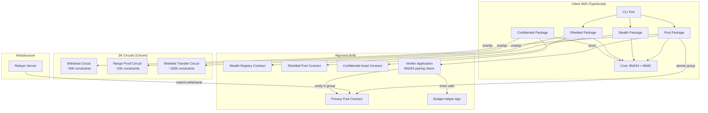
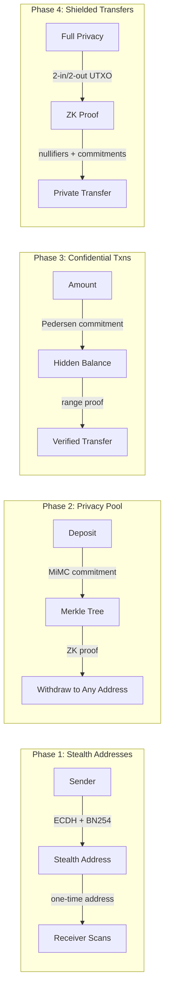
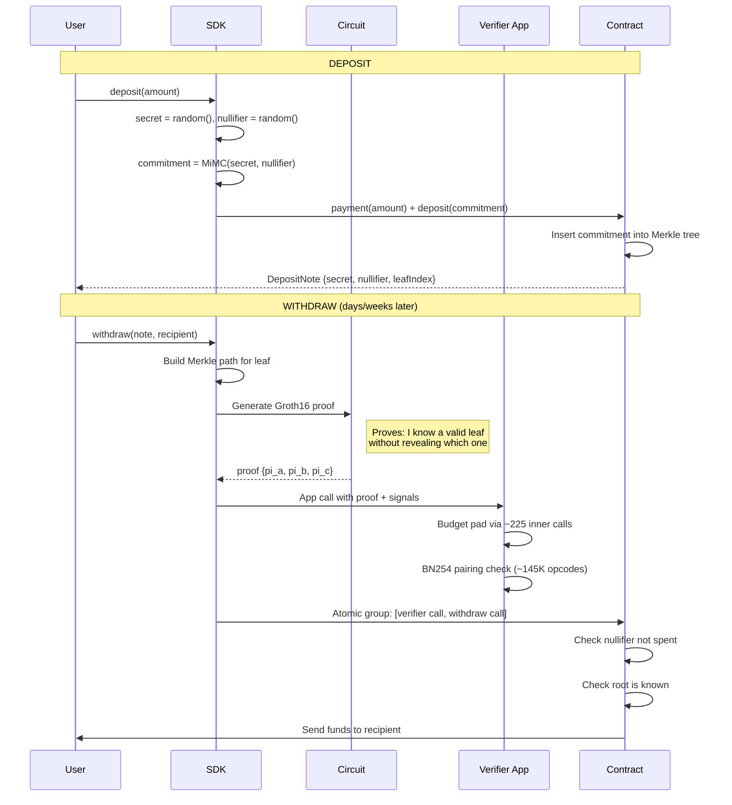
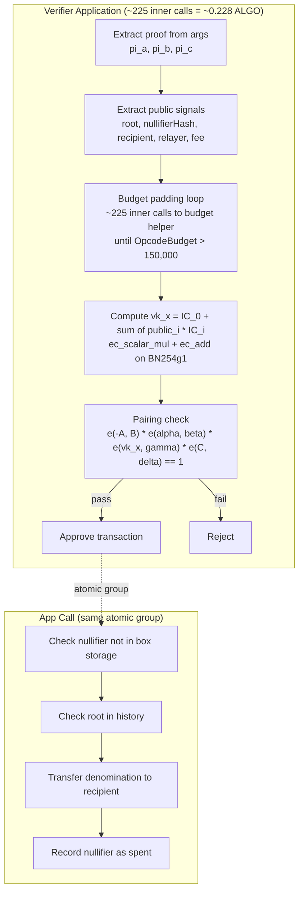
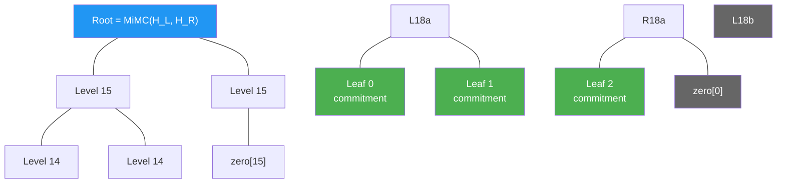

# privacy-sdk

Zero-knowledge privacy primitives for Algorand. Stealth addresses, privacy pools, confidential transactions, and shielded transfers — all powered by Groth16 ZK proofs and BN254 curve operations on the AVM.

## Architecture



## Privacy Primitives



## How the Privacy Pool Works



## Groth16 Verification on AVM



## Merkle Tree (Incremental, Depth 16)



## Project Structure

```
privacy-sdk/
├── packages/
│   ├── core/           # BN254 curve ops, MiMC hash, types
│   ├── pool/           # Privacy pool deposit/withdraw
│   ├── stealth/        # Stealth address protocol (ERC-5564)
│   ├── shielded/       # Full UTXO privacy system
│   ├── confidential/   # Hidden amounts (Pedersen commitments)
│   ├── circuits/       # Circuit artifacts & metadata
│   ├── relayer/        # HTTP relayer for private withdrawals
│   └── cli/            # Command-line interface
├── contracts/
│   ├── privacy-pool.algo.ts      # Tornado Cash model for Algorand
│   ├── stealth-registry.algo.ts  # Stealth meta-address registry
│   ├── shielded-pool.algo.ts     # Full privacy UTXO pool
│   ├── confidential-asset.algo.ts # Hidden transfer amounts
│   ├── generate-verifier.ts      # Generates TEAL verifier from vkey.json
│   ├── withdraw_verifier.teal    # Generated Groth16 verifier (BN254)
│   └── budget_helper.teal        # NoOp app for opcode budget padding
├── circuits/
│   ├── withdraw.circom           # Withdrawal proof (~30K constraints)
│   ├── merkleTree.circom         # MiMC Merkle membership
│   ├── range-proof.circom        # Amount range proofs
│   ├── shielded-transfer.circom  # Full shielded transfer (~150K constraints)
│   └── build/                    # Compiled WASM, zkeys, vkeys
├── scripts/
│   ├── deploy-verifier.ts        # Deploy verifier + budget helper to testnet
│   └── fund-pool.ts              # Fund pool contract
├── frontend/                     # React frontend (Cloudflare Pages)
├── demo.ts             # Interactive demo (no blockchain needed)
└── test-testnet.ts     # Testnet integration tests
```

## Quick Start

```bash
# Install dependencies
npm install

# Run the interactive demo (no blockchain needed)
npx tsx demo.ts

# Generate and verify a real ZK proof
npx tsx test-proof.ts

# Build ZK circuits (requires circom + snarkjs)
cd circuits && bash build.sh
```

## ZK Proof Test Output

```
════════════════════════════════════════════════════════════
  Real ZK Proof — Withdrawal Circuit
════════════════════════════════════════════════════════════

  Initializing MiMC sponge (circomlib-compatible, 220 rounds)...
  Creating deposit (secret + nullifier)...
  Commitment: 76232192545840885598...
  NullifierHash: 68893552353962002315...
  Building Merkle tree (depth 16, 1 leaf)...
  Merkle root: 20340347044506301858...
  Generating Groth16 proof (this takes 5-15 seconds)...
  Proof generated in 2.1s
  Proof size: pi_a(2), pi_b(4), pi_c(2) = 8 field elements
  Verifying proof...
  Proof valid: true
```

## Live Frontend

**URL**: https://algo-privacy.pages.dev (Cloudflare Pages, Algorand Testnet)

To use: Install Pera Wallet, go to Settings > Developer Settings > Node Settings > Testnet, fund from the [testnet dispenser](https://bank.testnet.algorand.network/), then connect at the URL above.

**Build & Deploy**:
```bash
cd frontend && npx vite build
npx wrangler pages deploy dist --project-name algo-privacy --branch main --commit-dirty=true
```

### What's Working

| Feature | Status | Notes |
|---------|--------|-------|
| Wallet connect (Pera/Defly) | Working | via @txnlab/use-wallet-react |
| Deposit (variable 0-1 ALGO) | Working | MiMC commitment + Merkle tree insert |
| Withdraw (Send to address) | Working | ZK proof + verifier app in 2-txn atomic group |
| Private Send (deposit+withdraw) | Working | One-click deposit-then-withdraw to destination |
| Split notes | Working | Withdraw original, re-deposit as two notes via slider UI |
| Combine notes | Working | Select 2+ checkboxes, withdraw all, re-deposit as one |
| Pool balance badge | Working | Queries indexer for grouped deposits minus withdrawals |
| Your balance badge | Working | Sum of local notes (localStorage) |
| Note recovery | Working | Re-derives notes from master key, checks nullifiers on-chain |
| Cost breakdown | Working | Per-operation fee breakdown with tooltip explanations |
| Animated pool blob | Working | Metaball visualization scales with pool balance |
| Toast notifications | Working | Success/error feedback |

### Key Files

```
frontend/
├── src/
│   ├── App.tsx                        # Main layout, badges, blob
│   ├── components/
│   │   ├── TransactionFlow.tsx        # Deposit/Send/Manage tabs, split/combine UI
│   │   ├── PoolBlob.tsx               # Animated background blob
│   │   ├── CostBreakdown.tsx          # Fee breakdown with tooltips + wallet balance
│   │   └── StatusBar.tsx              # Network/wallet status
│   ├── hooks/
│   │   ├── useTransaction.ts          # deposit, withdraw, privateSend, splitNote, combineNotes
│   │   ├── usePoolState.ts            # Pool balance (indexer), user balance (notes), wallet balance
│   │   └── useDeploy.ts              # Contract deployment
│   ├── lib/
│   │   ├── privacy.ts                 # MiMC, commitments, nullifiers, note storage, recovery
│   │   ├── tree.ts                    # Client-side MiMC Merkle tree (depth 16)
│   │   ├── config.ts                  # Contract addresses, algod/indexer endpoints
│   │   └── errorMessages.ts           # Human-readable error mapping
│   └── styles/
│       ├── globals.css                # Theme variables, fonts
│       └── components.css             # All component styles
├── public/
│   ├── circuits/                      # withdraw.wasm, withdraw_final.zkey
│   └── contracts/                     # withdraw_verifier.teal, withdraw_verifier_clear.teal
└── vite.config.ts
```

### Contracts (Testnet)

| Contract | App ID | Notes |
|----------|--------|-------|
| Privacy Pool | 756386181 | Main pool — deposits, withdrawals, Merkle tree |
| Stealth Registry | 756386179 | Stealth meta-address registry |
| Shielded Pool | 756386192 | Full UTXO privacy system |
| Confidential Asset | 756386193 | Hidden transfer amounts |
| ZK Verifier | 756401238 | Groth16 BN254 pairing check |
| Budget Helper | 756401228 | NoOp app for opcode budget padding |

### Known Issues / TODO

- **Note persistence**: Notes are in localStorage only. Clearing browser data loses notes. Recovery re-derives from master key but requires wallet signature.
- **Pool balance accuracy**: Uses indexer to count grouped payments minus inner-txn payments. Polls every 30s.
- **Relayer**: The relayer field exists in the circuit but is currently set to the zero address. A relayer would enable withdrawals without linking the sender's wallet.
- **Wallet linkability**: The signing wallet is visible as the sender of all transactions. For true unlinkability, a relayer is needed to submit withdrawal transactions on behalf of the user.

## On-Chain Costs

| Operation | Cost | Details |
|-----------|------|---------|
| Deposit | ~0.002 ALGO | Payment (0.001) + app call (0.001), 3 box refs |
| Withdraw / Send | ~0.232 ALGO | Verifier app call (0.228, covers ~225 inner budget calls) + pool app call (0.002) + deposit (0.002) |
| Split | ~0.234 ALGO | 1 withdraw (0.230) + 2 deposits (0.004) |
| Combine (2 notes) | ~0.462 ALGO | 2 withdraws (0.460) + 1 deposit (0.002) |
| Stealth Register | ~0.05 ALGO | Box MBR for meta-address (128 bytes) |

Most of the cost comes from the ZK proof verification step — the BN254 pairing check needs ~145,000 opcodes, which requires ~225 inner app calls to the budget helper at 0.001 ALGO each.

## Tech Stack

- **Circuits**: Circom 2.1.6 + snarkjs (Groth16)
- **Curve**: BN254 (alt_bn128) — native AVM v11 support
- **Hash**: MiMC Sponge (220 rounds, x^5 Feistel) — compatible with circomlib
- **Contracts**: TealScript (compiles to TEAL for AVM)
- **Verifier**: Generated TEAL application from verification key (gnark-crypto G2 encoding)
- **SDK**: TypeScript monorepo (npm workspaces)
- **Proving**: snarkjs WASM prover (~2s proof generation in browser)
- **Verification**: BN254 pairing check via AVM opcodes (`ec_add`, `ec_scalar_mul`, `ec_pairing_check`)
- **Frontend**: React + Vite, deployed on Cloudflare Pages

## AVM Requirements

- AVM v11 for BN254 curve operations (`ec_scalar_mul`, `ec_add`, `ec_pairing_check`)
- Box storage for Merkle tree, nullifier set, root history
- Application opcode budget pooling (~225 inner calls to budget helper for ~150K opcodes)

## License

MIT
