# 2birds

Zero-knowledge privacy pool for Algorand. Deposit ALGO into fixed-denomination pools, withdraw to any address with a ZK proof — breaking the on-chain link between sender and receiver. PLONK LogicSig verification at ~0.007 ALGO per operation.

**Live**: [2birds.pages.dev](https://2birds.pages.dev) (Algorand Testnet)

## Architecture

```mermaid
graph TB
    subgraph "Frontend — 2birds.pages.dev"
        UI[TransactionFlow UI]
        HOOKS[useTransaction Hook]
        PRIV[privacy.ts — MiMC, notes, recovery]
        TREE[tree.ts — Client-side Merkle tree]
        HPKE[hpke.ts — Encrypted on-chain notes]
        SCAN[scanner.ts — Chain note recovery]
        AC[Anti-Correlation<br/>Soak · Cooldown · Jitter]
    end

    subgraph "ZK Circuits — Circom + snarkjs"
        DC[Deposit ~42K constraints]
        WC[Withdraw ~23K constraints]
        PSC[PrivateSend ~44K constraints]
        SC[Split ~66K constraints]
        CC[Combine ~66K constraints]
    end

    subgraph "Algorand AVM — Testnet"
        PLONK["PLONK LogicSig Verifiers<br/>4 txns per proof, 0.004 ALGO"]
        PP1["Pool 0.1 ALGO<br/>App 756478534"]
        PP5["Pool 0.5 ALGO<br/>App 756478549"]
        PP10["Pool 1.0 ALGO<br/>App 756480627"]
    end

    subgraph "Infrastructure"
        REL1[Relayer 1<br/>CF Worker]
        REL2[Relayer 2<br/>CF Worker]
        R2[Cloudflare R2<br/>PLONK zkeys]
        IPFS[IPFS Fallback<br/>zkey mirror]
    end

    UI --> HOOKS
    HOOKS --> PRIV & TREE & HPKE & AC
    HOOKS -->|snarkjs| DC & WC & PSC & SC & CC
    HOOKS -->|LogicSig group| PLONK
    HOOKS -->|app call| PP1 & PP5 & PP10
    SCAN -->|indexer| PP1 & PP5 & PP10
    HOOKS -->|fetch zkeys| R2
    R2 -.->|fallback| IPFS
    REL1 & REL2 -->|submit withdrawal| PLONK
    REL1 & REL2 -->|app call| PP1 & PP5 & PP10

    style PLONK fill:#4CAF50,color:#fff
    style AC fill:#e91e63,color:#fff
```

## How It Works

### Deposit Flow

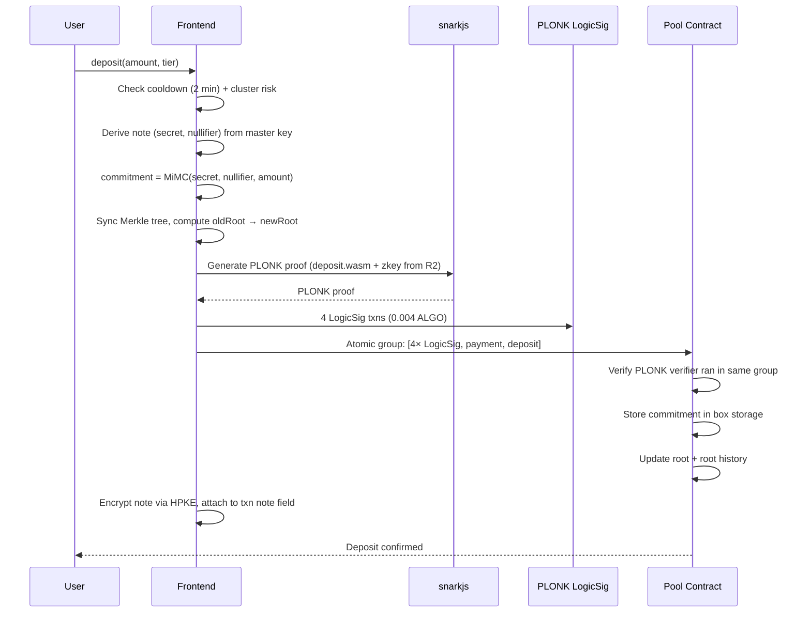

### Withdraw Flow (via Relayer)

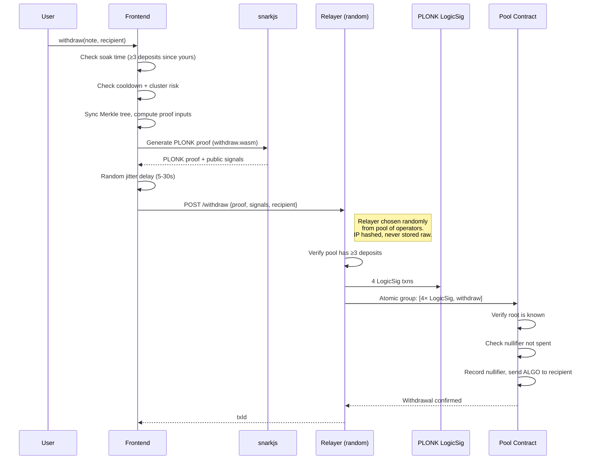

### PrivateSend Flow

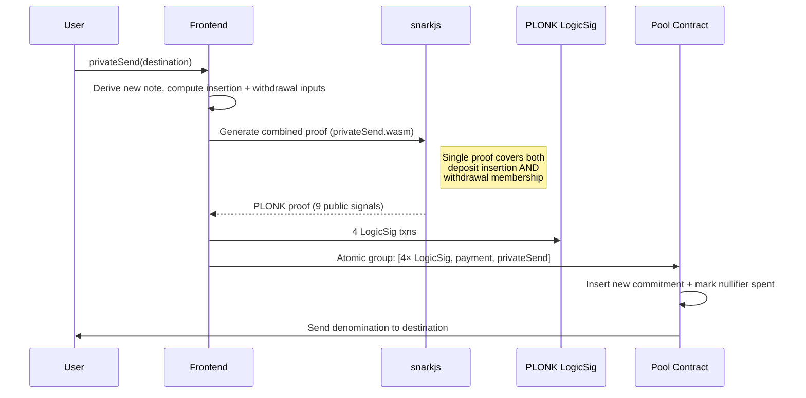

### PLONK LogicSig Verification (30x cheaper than Groth16)

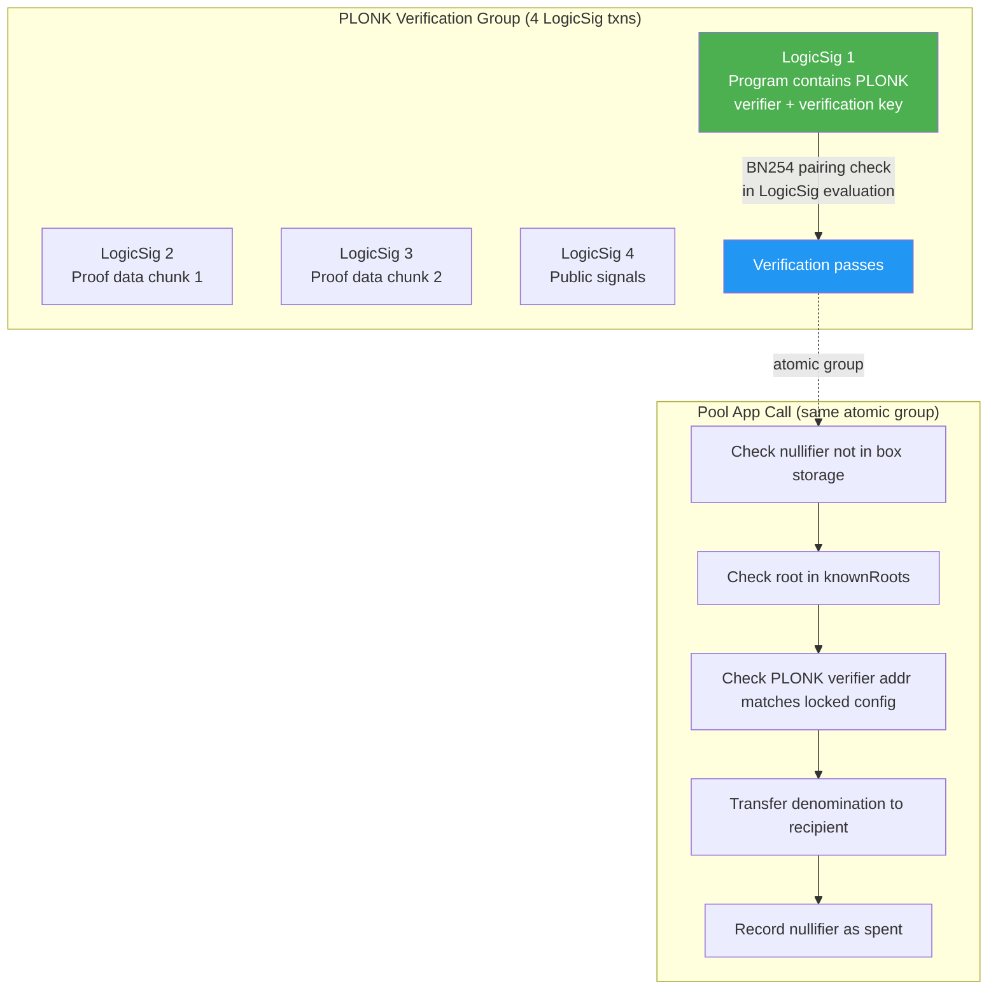

**Why PLONK LogicSig?** Groth16 verification required ~200 inner app calls for opcode budget (~0.2 ALGO). PLONK verification runs inside a LogicSig program — 4 txns at 0.001 ALGO each = 0.004 ALGO. Same cryptographic security, 30x cheaper.

### Anti-Correlation Protections

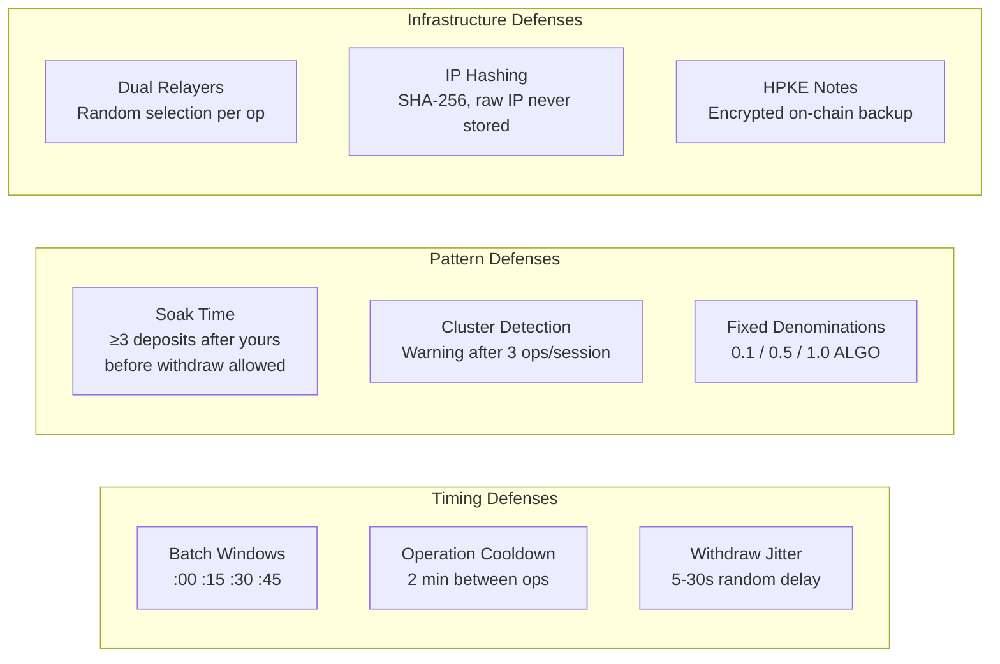

### Merkle Tree (Incremental, Depth 16)

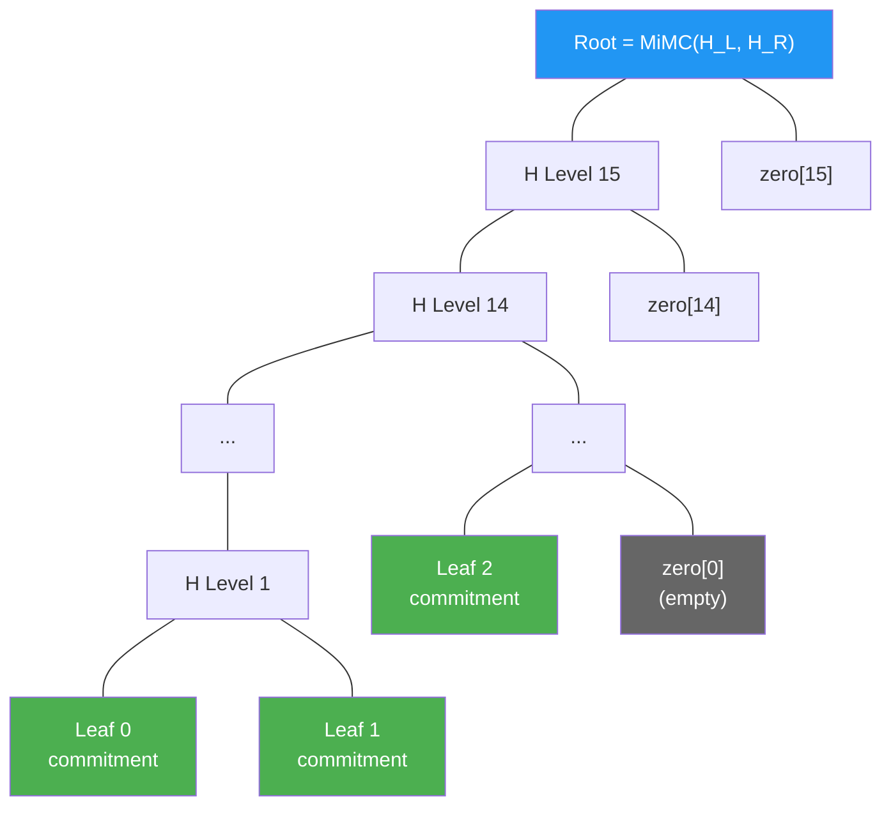

Each leaf is `MiMC(secret, nullifier, amount)`. Siblings are hashed up with MiMC Sponge (220 rounds, x^5 Feistel). Tree supports ~65K deposits (2^16 leaves).

### View/Spend Key Derivation

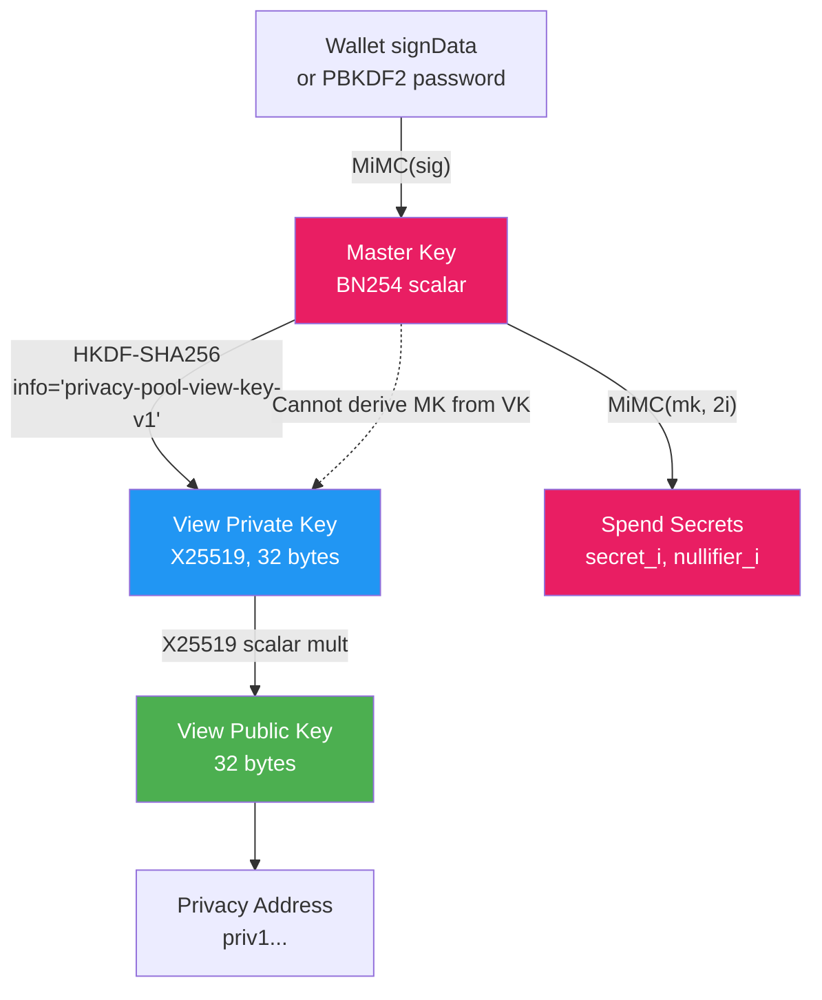

The view key can decrypt HPKE envelopes to see note contents (amounts, leaf indices) but cannot spend notes. The master key is required for spending.

### HPKE Envelope Format

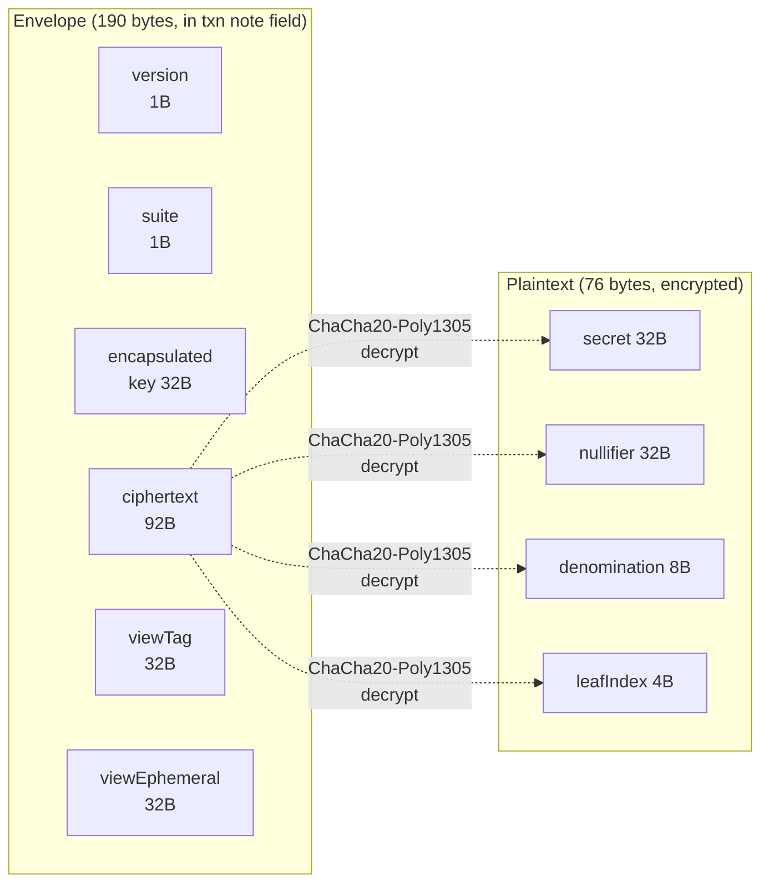

HPKE suite: X25519 + HKDF-SHA256 + ChaCha20-Poly1305. View tag enables fast scanning before full decryption.

### Split/Combine Flow

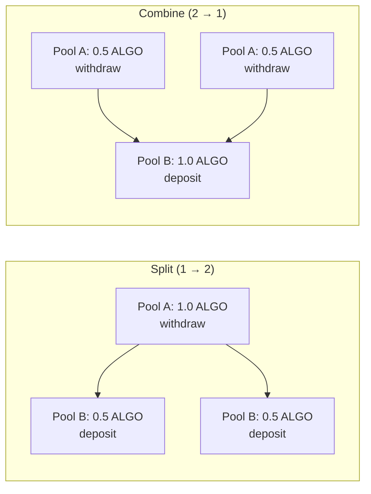

## Features

| Feature | Status | Notes |
|---------|--------|-------|
| Wallet connect (Pera/Defly) | Working | via @txnlab/use-wallet-react |
| Multi-tier pools (0.1 / 0.5 / 1.0 ALGO) | Working | Fixed-denomination pools |
| Deposit with ZK proof | Working | PLONK LogicSig verification |
| Withdraw to any address | Working | ZK Merkle membership proof |
| Private Send (atomic deposit+withdraw) | Working | Single combined proof |
| Split (1→2 across pools) | Working | Denomination conservation proof |
| Combine (2→1 across pools) | Working | Denomination conservation proof |
| Relayer for private withdrawals | Working | 2 CF Workers, random selection |
| PLONK LogicSig verification | Working | 30x cheaper than Groth16 |
| Deterministic note derivation | Working | Master key from wallet signature |
| HPKE encrypted notes | Working | X25519/ChaCha20-Poly1305 on-chain |
| View/spend key separation | Working | View key decrypts, master key spends |
| Privacy addresses (priv1...) | Working | Bech32 with Algorand + view pubkey |
| Chain scanner | Working | View key scans txn notes for recovery |
| Anti-correlation protections | Working | Soak, cooldown, jitter, cluster detection |
| SRI integrity hashes | Working | SHA-384 on all JS/CSS assets |
| R2 + IPFS zkey hosting | Working | Dual-source fallback for PLONK zkeys |

## Contracts (Testnet)

| Contract | App ID | Notes |
|----------|--------|-------|
| Pool — 0.1 ALGO | 756478534 | Fixed denomination, PLONK verifiers locked |
| Pool — 0.5 ALGO | 756478549 | Fixed denomination, PLONK verifiers locked |
| Pool — 1.0 ALGO | 756480627 | Fixed denomination, PLONK verifiers locked |
| Withdraw Verifier (Groth16) | 756420114 | Legacy — 6 public signals |
| Deposit Verifier (Groth16) | 756420115 | Legacy — 4 public signals |
| PrivateSend Verifier (Groth16) | 756420116 | Legacy — 9 public signals |
| Budget Helper | 756420102 | NoOp app for Groth16 opcode budget |
| Stealth Registry | 756386179 | Stealth meta-address registry |

### PLONK LogicSig Verifier Addresses (Testnet)

| Circuit | Address |
|---------|---------|
| Withdraw | `Y5EGJIAMTCQJ5VYEPPNHUXLJ2QOAQRFION77ILEOFM63V5DOURIOSLE2XE` |
| Deposit | `T7LRWUZ3PL5RPGNMFDQNU7KETGLG2KKXV2YWODJ4KZFJSN5I3IPQEH7E44` |
| PrivateSend | `ANQG655MULTMHGQVJEEBKUDISGQ7OFNG7WBQXQPHQOKH4LSO5QMNA2KLIE` |

These addresses are permanently locked via `setPlonkVerifiers` (one-shot function — cannot be changed by the creator or anyone else).

## On-Chain Costs

| Operation | PLONK LogicSig | Groth16 (legacy) |
|-----------|----------------|-------------------|
| Deposit | **0.007 ALGO** | 0.206 ALGO |
| Withdraw | **0.006 ALGO** | 0.215 ALGO |
| Private Send | **0.007 ALGO** | 0.226 ALGO |
| Split | **0.014 ALGO** | 0.440 ALGO |
| Combine | **0.014 ALGO** | 0.440 ALGO |
| Relayer fee | **0.05 ALGO** | — |

PLONK verification runs inside LogicSig programs (4 txns at 0.001 ALGO each). Groth16 required ~200 inner app calls for opcode budget. **PLONK is ~30x cheaper.**

### Total Cost Per Operation (PLONK + Relayed)

| Operation | User Pays | What Happens |
|-----------|-----------|--------------|
| Deposit | denomination + 0.057 ALGO | ZK proof + pool insertion |
| Withdraw (relayed) | 0.05 ALGO from denomination | Relayer submits, user untraceable |
| Private Send | denomination + 0.057 ALGO | Atomic withdraw + deposit |

## 2birds vs HermesVault

### Feature Comparison

| | 2birds | HermesVault |
|---|---|---|
| **Proof system** | PLONK (circom + snarkjs) | PLONK (gnark via AlgoPlonk) |
| **Verification** | LogicSig (4 txns) | LogicSig (AlgoPlonk) |
| **Denomination tiers** | 0.1 / 0.5 / 1.0 ALGO | 10 / 100 / 1000 ALGO |
| **Cost per op** | ~0.007 ALGO | ~0.007 ALGO |
| **Relayer** | Yes (0.05 ALGO fee) | No |
| **Unlinkability** | Full (relayer breaks tx graph) | Partial (user submits own tx) |
| **Note backup** | HPKE encrypted on-chain | localStorage only |
| **View/spend separation** | Yes (X25519 view key) | No |
| **Privacy addresses** | Yes (priv1...) | No |
| **Anti-correlation** | Soak, cooldown, jitter, cluster | None |
| **Contract mutability** | Immutable (one-shot lock) | Immutable |
| **IP protection** | SHA-256 hashed, never stored raw | N/A (no relayer) |
| **Split/combine** | Yes (cross-pool) | No |
| **Dual relayers** | Yes (random selection) | N/A |
| **SRI hashes** | Yes (SHA-384) | No |
| **zkey hosting** | R2 + IPFS fallback | Bundled |

### Cost Comparison

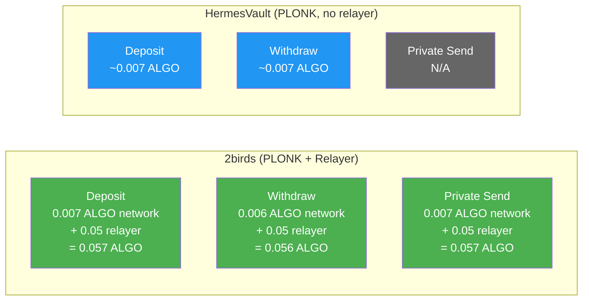

### Exploitability Comparison

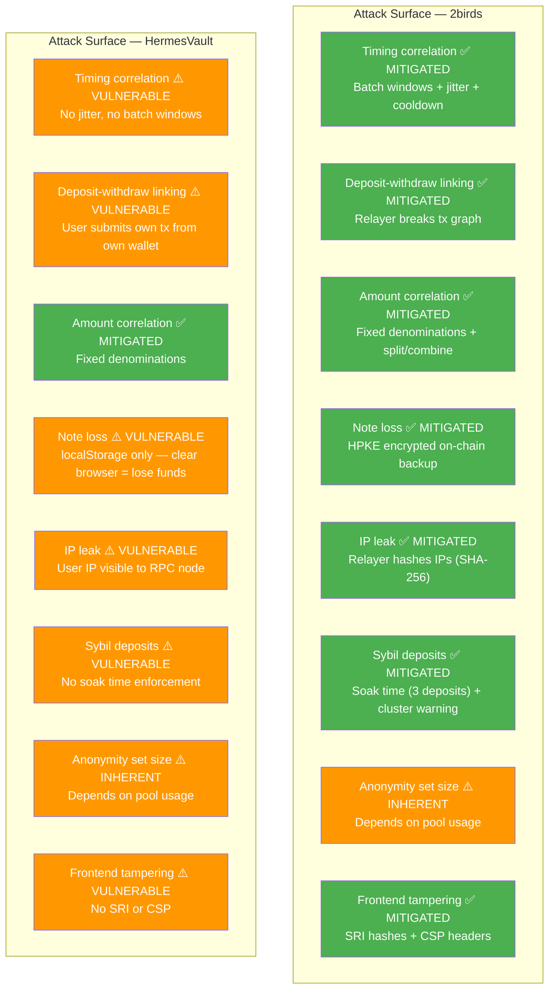

### Summary

| Attack Vector | 2birds | HermesVault |
|---|---|---|
| Timing correlation | **Mitigated** — batch windows, jitter (5-30s), cooldown (2 min) | Vulnerable — no timing defenses |
| Deposit-withdraw linking | **Mitigated** — relayer submits tx, user never touches chain | Vulnerable — user wallet submits withdraw tx |
| IP metadata leak | **Mitigated** — relayer hashes IPs with SHA-256 | Vulnerable — user IP visible to Algorand RPC |
| Note loss risk | **Mitigated** — HPKE encrypted backup in on-chain txn notes | Vulnerable — localStorage only |
| Sybil / immediate withdraw | **Mitigated** — soak time (3 deposits), cluster detection | Vulnerable — no soak enforcement |
| Frontend tampering | **Mitigated** — SRI SHA-384 + CSP headers | Vulnerable — no integrity checks |
| Amount correlation | **Mitigated** — fixed tiers + split/combine | Mitigated — fixed tiers |
| Contract trust | **Equal** — one-shot locked, immutable | Equal — immutable |
| Anonymity set | Depends on usage | Depends on usage |

**HermesVault is cheaper** (no relayer fee). **2birds is more private** (7/8 attack vectors mitigated vs 2/8).

## Infrastructure

| Resource | Provider | Cost |
|----------|----------|------|
| Frontend | Cloudflare Pages | Free |
| Relayer 1 | Cloudflare Workers | Free (100K req/day) |
| Relayer 2 | Cloudflare Workers | Free |
| PLONK zkeys | Cloudflare R2 | Free (10GB/month) |
| zkey fallback | IPFS (kubo) | Free |
| Algorand RPC | Algonode | Free |
| **Total** | | **$0/month** |

## Project Structure

```
privacy-sdk/
├── circuits/
│   ├── deposit.circom              # Insertion proof (~42K constraints)
│   ├── withdraw.circom             # Withdrawal proof (~23K constraints)
│   ├── privateSend.circom          # Combined deposit+withdraw (~44K constraints)
│   ├── split.circom                # Split 1→2 across pools
│   ├── combine.circom              # Combine 2→1 across pools
│   ├── merkleTree.circom           # MiMC Merkle tree + commitment hasher
│   ├── build.sh                    # Circuit compilation + trusted setup
│   └── build/                      # WASM, zkeys, vkeys, ptau
├── contracts/
│   ├── privacy-pool.algo.ts        # Pool: deposit, withdraw, privateSend, split, combine
│   ├── generate-plonk-verifier.ts  # Generates PLONK LogicSig TEAL from vkey
│   ├── artifacts/                  # Compiled TealScript ARC-56 artifacts
│   └── *.teal                      # Groth16 verifiers (legacy)
├── frontend/
│   ├── src/
│   │   ├── components/             # TransactionFlow, CostBreakdown, PoolBlob
│   │   ├── hooks/
│   │   │   ├── useTransaction.ts   # Deposit, withdraw, privateSend + anti-correlation
│   │   │   └── usePoolState.ts     # Pool balance, user balance
│   │   ├── lib/
│   │   │   ├── privacy.ts          # MiMC, commitments, notes, R2/IPFS zkey fetching
│   │   │   ├── hpke.ts             # HPKE envelope encrypt/decrypt
│   │   │   ├── scanner.ts          # Chain scanner for note recovery
│   │   │   ├── keys.ts             # View/spend key derivation
│   │   │   ├── address.ts          # Bech32 priv1... privacy addresses
│   │   │   ├── tree.ts             # Client-side MiMC Merkle tree
│   │   │   ├── config.ts           # Contracts, fees, relayers, anti-correlation
│   │   │   └── plonkVerifierLsig.ts # PLONK LogicSig transaction building
│   │   └── styles/
│   ├── public/circuits/            # Groth16 wasm+zkey (PLONK zkeys on R2)
│   ├── scripts/add-sri.sh          # Post-build SRI hash injection
│   └── .env                        # VITE_USE_PLONK_LSIG=true
├── relayer/
│   ├── src/index.ts                # CF Worker — IP hashing, rate limits, pool checks
│   └── wrangler.toml               # Worker config + pool IDs
├── relayer-2/
│   ├── src/index.ts                # Second relayer (separate operator)
│   ├── wrangler.toml
│   └── setup.sh                    # One-shot setup for new relayer operators
├── scripts/
│   ├── deploy-all.ts               # Deploy contracts + verifiers
│   ├── deploy-plonk-pools.ts       # Deploy PLONK-enabled pools
│   └── fund-and-finalize.ts        # Fund pools + lock PLONK verifiers
└── packages/                       # Legacy SDK packages
```

## Quick Start

```bash
# Install dependencies
npm install

# Run the interactive demo (no blockchain needed)
npx tsx demo.ts

# Build ZK circuits (requires circom + snarkjs)
cd circuits && bash build.sh

# Build frontend (with SRI hashes)
cd frontend && npm run build

# Deploy frontend to Cloudflare Pages
cd frontend && npx wrangler pages deploy dist --project-name 2birds

# Deploy relayer
cd relayer && npm run deploy
```

## Tech Stack

- **Circuits**: Circom 2.1.6 + snarkjs (PLONK + Groth16, BN254)
- **Verification**: PLONK LogicSig (4 txns, 0.004 ALGO) — 30x cheaper than Groth16 app calls
- **Hash**: MiMC Sponge (220 rounds, x^5 Feistel)
- **Contracts**: TealScript → TEAL for AVM v11
- **Frontend**: React + Vite on Cloudflare Pages
- **Relayer**: 2× Cloudflare Workers (TypeScript)
- **Proving**: snarkjs WASM prover (~2-10s in browser)
- **Note encryption**: HPKE (X25519 + HKDF-SHA256 + ChaCha20-Poly1305)
- **Key derivation**: HKDF for view keys, MiMC for spend secrets
- **Addresses**: Bech32 `priv1...` encoding Algorand pubkey + view pubkey
- **zkey hosting**: Cloudflare R2 (primary) + IPFS (fallback)
- **Integrity**: SRI SHA-384 hashes on all frontend assets

## Security Model

- **ZK proofs**: PLONK on BN254 — same cryptographic hardness as Groth16
- **Contract immutability**: `setPlonkVerifiers` is one-shot — verifier addresses are permanently locked after first call
- **Relayer privacy**: IPs hashed with SHA-256 before rate-limit storage, raw IPs never persisted
- **Dual relayers**: Frontend randomly picks one per operation — no single operator sees all traffic
- **Anti-correlation**: Soak time (3 deposits), cooldown (2 min), jitter (5-30s), cluster warnings (3 ops/session)
- **Frontend integrity**: SRI hashes on all JS/CSS, CSP headers restrict script/connect sources
- **Note recovery**: HPKE-encrypted notes stored on-chain — recoverable with view key even after clearing browser data

## License

MIT
