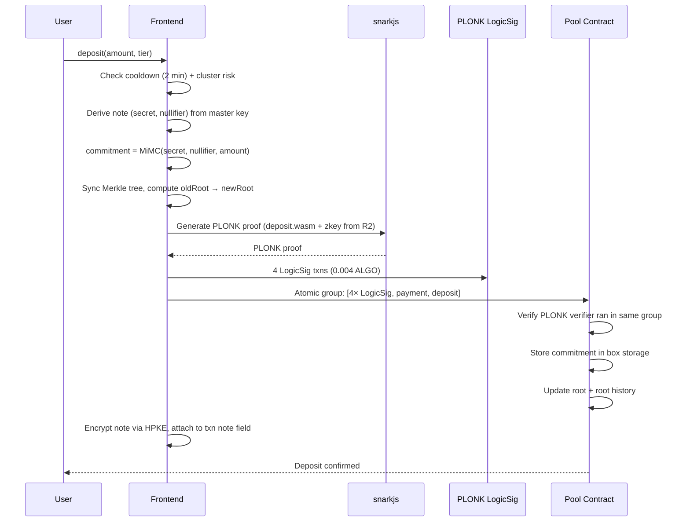
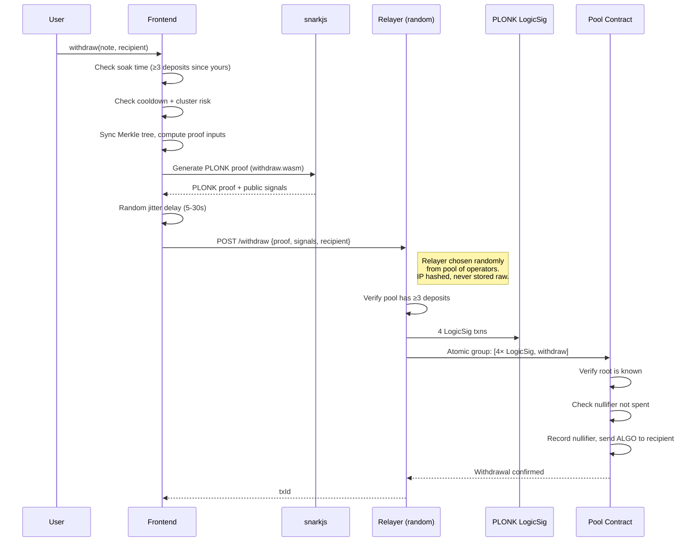
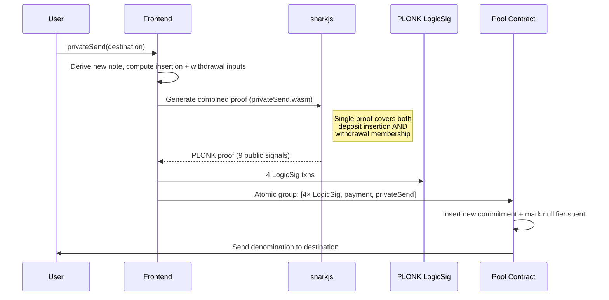
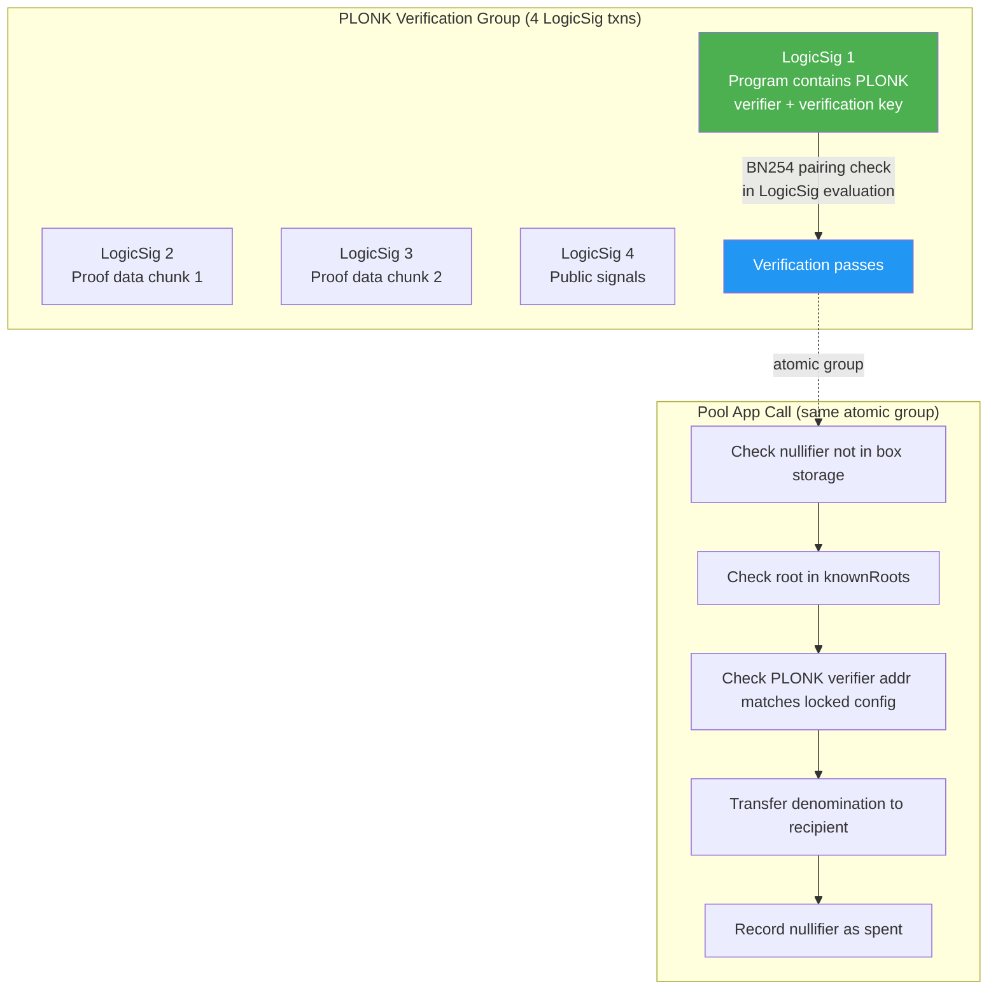
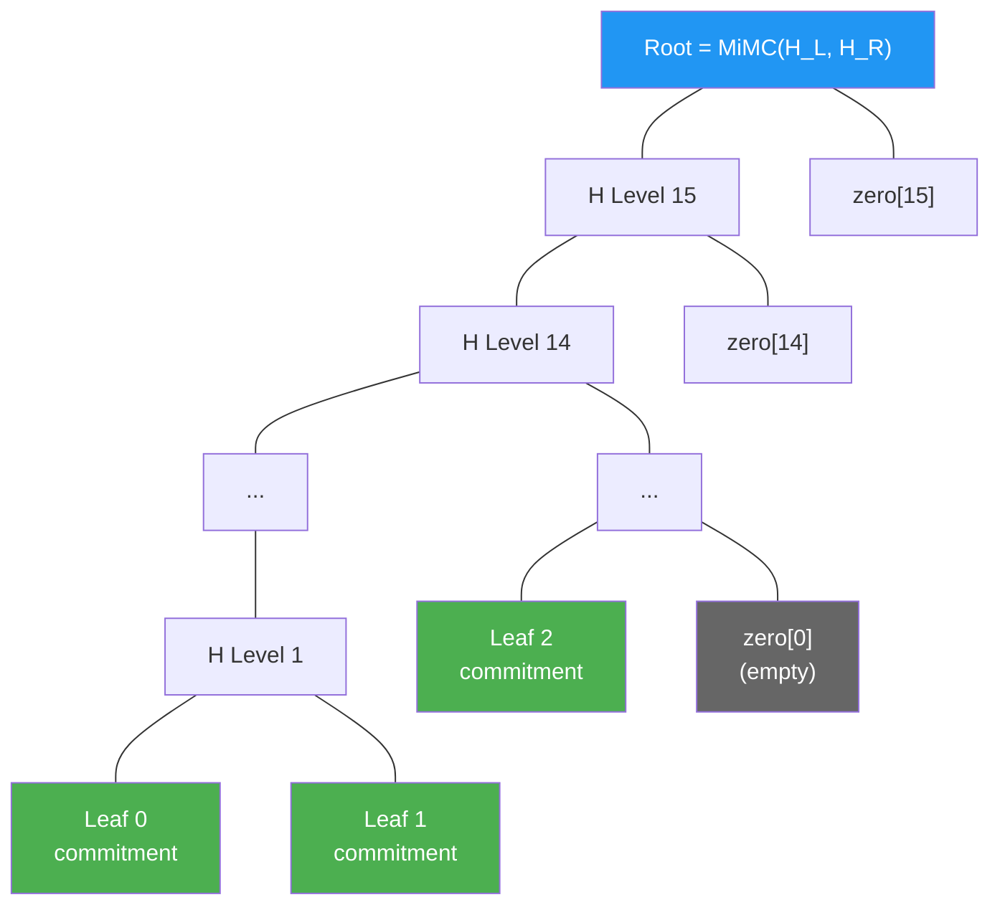
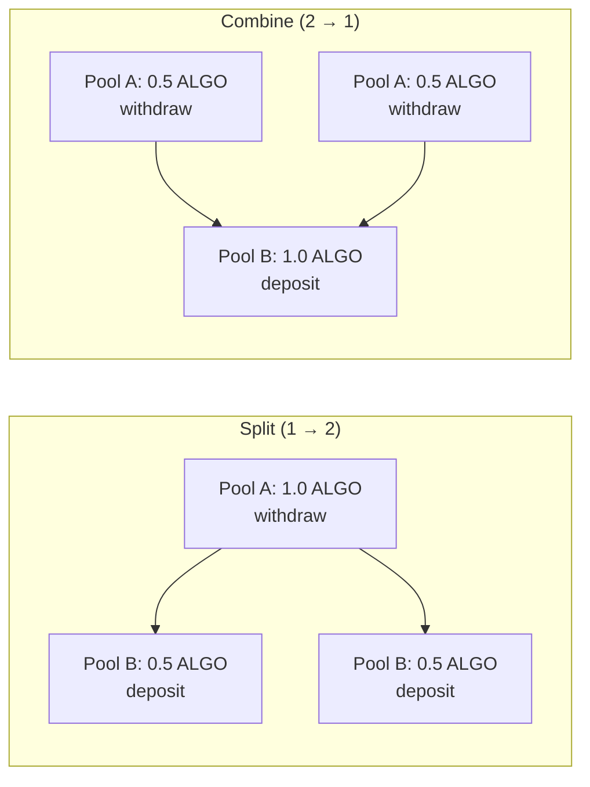

# Architecture

## System Overview

```mermaid
graph TB
    subgraph "Frontend — 2birds.pages.dev"
        UI[TransactionFlow UI]
        HOOKS[useTransaction Hook]
        PRIV[privacy.ts — MiMC, notes, recovery]
        TREE[tree.ts — Client-side Merkle tree]
        HPKE[hpke.ts — Encrypted on-chain notes]
        SCAN[scanner.ts — Chain note recovery]
        AC[Anti-Correlation<br/>Soak · Cooldown · Jitter]
    end

    subgraph "ZK Circuits — Circom + snarkjs"
        DC[Deposit ~42K constraints]
        WC[Withdraw ~23K constraints]
        PSC[PrivateSend ~44K constraints]
        SC[Split ~66K constraints]
        CC[Combine ~66K constraints]
    end

    subgraph "Algorand AVM — Testnet"
        PLONK["PLONK LogicSig Verifiers<br/>4 txns per proof, 0.004 ALGO"]
        PP1["Pool 0.1 ALGO<br/>App 756478534"]
        PP5["Pool 0.5 ALGO<br/>App 756478549"]
        PP10["Pool 1.0 ALGO<br/>App 756480627"]
    end

    subgraph "Infrastructure"
        REL1[Relayer 1<br/>CF Worker]
        REL2[Relayer 2<br/>CF Worker]
        R2[Cloudflare R2<br/>PLONK zkeys]
        IPFS[IPFS Fallback<br/>zkey mirror]
    end

    UI --> HOOKS
    HOOKS --> PRIV & TREE & HPKE & AC
    HOOKS -->|snarkjs| DC & WC & PSC & SC & CC
    HOOKS -->|LogicSig group| PLONK
    HOOKS -->|app call| PP1 & PP5 & PP10
    SCAN -->|indexer| PP1 & PP5 & PP10
    HOOKS -->|fetch zkeys| R2
    R2 -.->|fallback| IPFS
    REL1 & REL2 -->|submit withdrawal| PLONK
    REL1 & REL2 -->|app call| PP1 & PP5 & PP10

    style PLONK fill:#4CAF50,color:#fff
    style AC fill:#e91e63,color:#fff
```

## Deposit Flow

## Withdraw Flow (via Relayer)

## PrivateSend Flow

## PLONK LogicSig Verification

**Why PLONK LogicSig?** Groth16 verification required ~200 inner app calls for opcode budget (~0.2 ALGO). PLONK verification runs inside a LogicSig program — 4 txns at 0.001 ALGO each = 0.004 ALGO. Same cryptographic security, 30x cheaper.

## Merkle Tree (Incremental, Depth 16)

Each leaf is `MiMC(secret, nullifier, amount)`. Siblings are hashed up with MiMC Sponge (220 rounds, x^5 Feistel). Tree supports ~65K deposits (2^16 leaves).

## Split/Combine Flow

