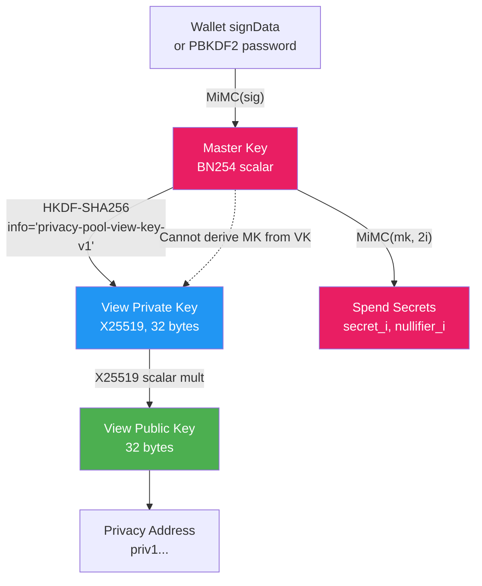
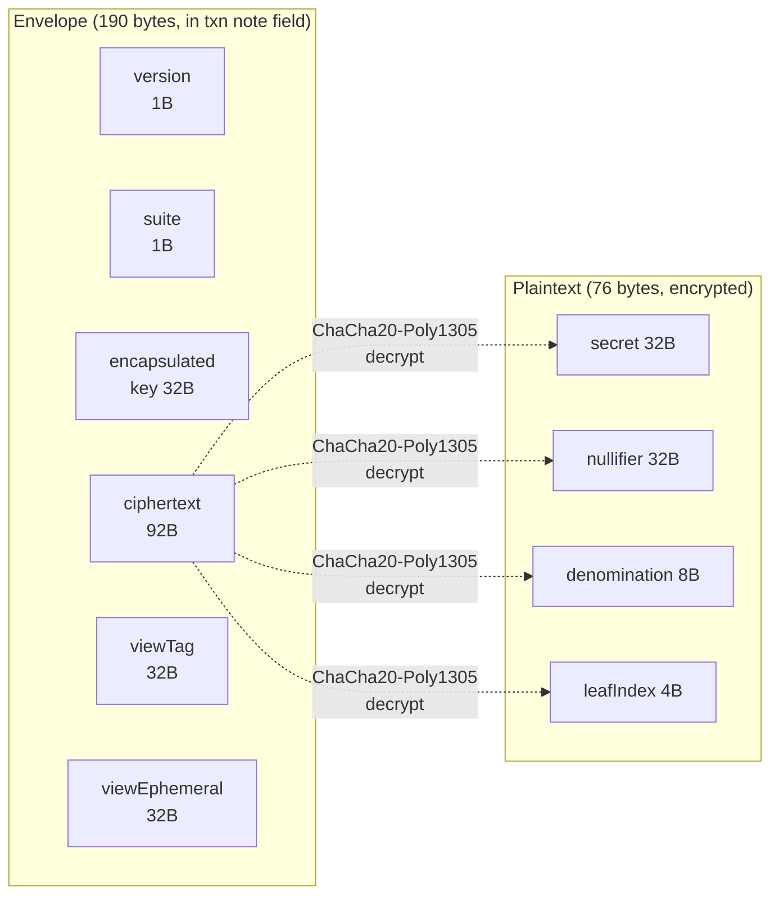
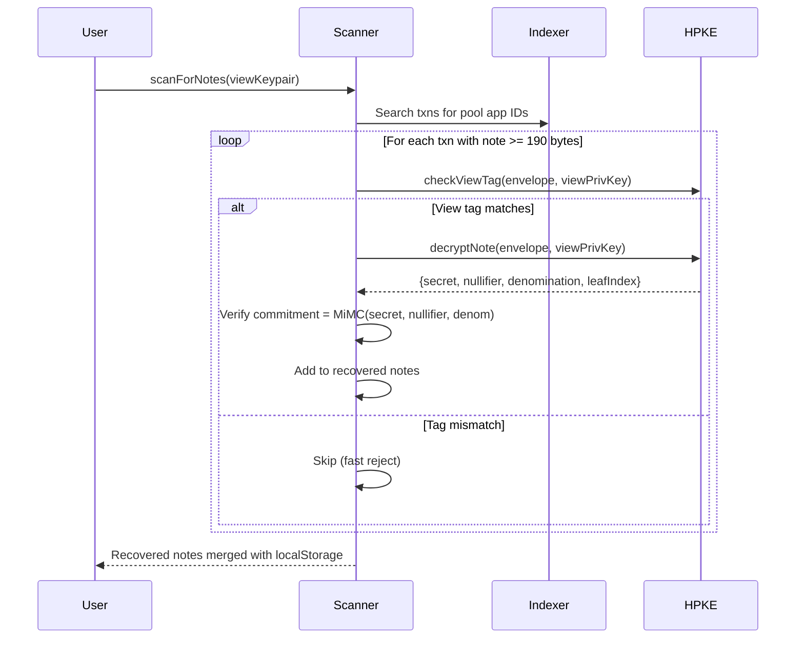

# Cryptography

## View/Spend Key Derivation



The view key can decrypt HPKE envelopes to see note contents (amounts, leaf indices) but cannot spend notes. The master key is required for spending (deriving secrets and nullifiers).

## HPKE Envelope Format



HPKE suite: X25519 + HKDF-SHA256 + ChaCha20-Poly1305. View tag enables fast scanning (ECDH check) before full HPKE decryption.

## Chain Scanning Flow



## Privacy Address Format

```
priv1... (bech32-encoded)
┌─────────┬──────────┬───────────────┬───────────────┐
│ version │ network  │ algo_pubkey   │ view_pubkey   │
│  (1B)   │  (1B)    │   (32B)       │   (32B)       │
└─────────┴──────────┴───────────────┴───────────────┘
         Total payload: 66 bytes
```

Share your `priv1...` address to receive private transfers. Senders decode it to get your Algorand address (for on-chain recipient) and view public key (for HPKE encryption). Recipients scan the chain with their view key to discover notes.
