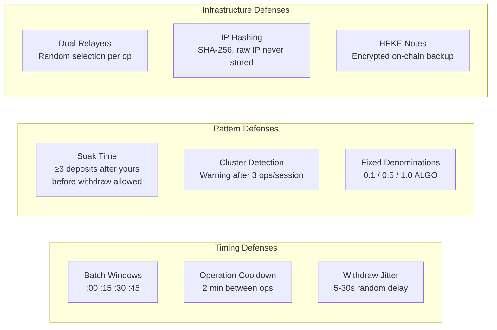
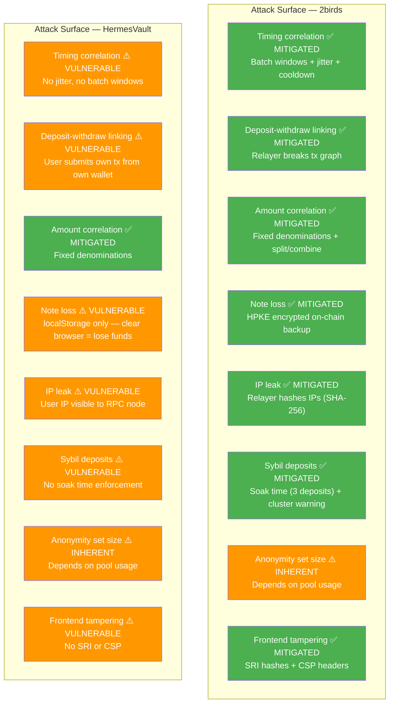

# Security Model

## Anti-Correlation Protections

## Trust Model

- **ZK proofs**: PLONK on BN254 — same cryptographic hardness as Groth16
- **Contract immutability**: `setPlonkVerifiers` is one-shot — verifier addresses are permanently locked after first call. The creator cannot swap verifiers.
- **Relayer trust**: Liveness only — relayers can censor (refuse to relay) but cannot steal funds or break privacy. If one relayer is down, the other is used automatically.
- **Relayer privacy**: IPs hashed with SHA-256 before rate-limit storage, raw IPs never persisted
- **Dual relayers**: Frontend randomly picks one per operation — no single operator sees all traffic
- **Frontend integrity**: SRI SHA-384 hashes on all JS/CSS, CSP headers restrict script/connect sources
- **Note recovery**: HPKE-encrypted notes stored on-chain — recoverable with view key even after clearing browser data
- **View key compromise**: If an attacker obtains your view key, they can see note contents but cannot spend. By design for auditability.

## Exploitability Comparison (2birds vs HermesVault)

| Attack Vector | 2birds | HermesVault |
|---|---|---|
| Timing correlation | **Mitigated** — batch windows, jitter (5-30s), cooldown (2 min) | Vulnerable — no timing defenses |
| Deposit-withdraw linking | **Mitigated** — relayer submits tx, user never touches chain | Vulnerable — user wallet submits withdraw tx |
| IP metadata leak | **Mitigated** — relayer hashes IPs with SHA-256 | Vulnerable — user IP visible to Algorand RPC |
| Note loss risk | **Mitigated** — HPKE encrypted backup in on-chain txn notes | Vulnerable — localStorage only |
| Sybil / immediate withdraw | **Mitigated** — soak time (3 deposits), cluster detection | Vulnerable — no soak enforcement |
| Frontend tampering | **Mitigated** — SRI SHA-384 + CSP headers | Vulnerable — no integrity checks |
| Amount correlation | **Mitigated** — fixed tiers + split/combine | Mitigated — fixed tiers |
| Contract trust | **Equal** — one-shot locked, immutable | Equal — immutable |
| Anonymity set | Depends on usage | Depends on usage |

**2birds mitigates 7/8 attack vectors. HermesVault mitigates 2/8.**
